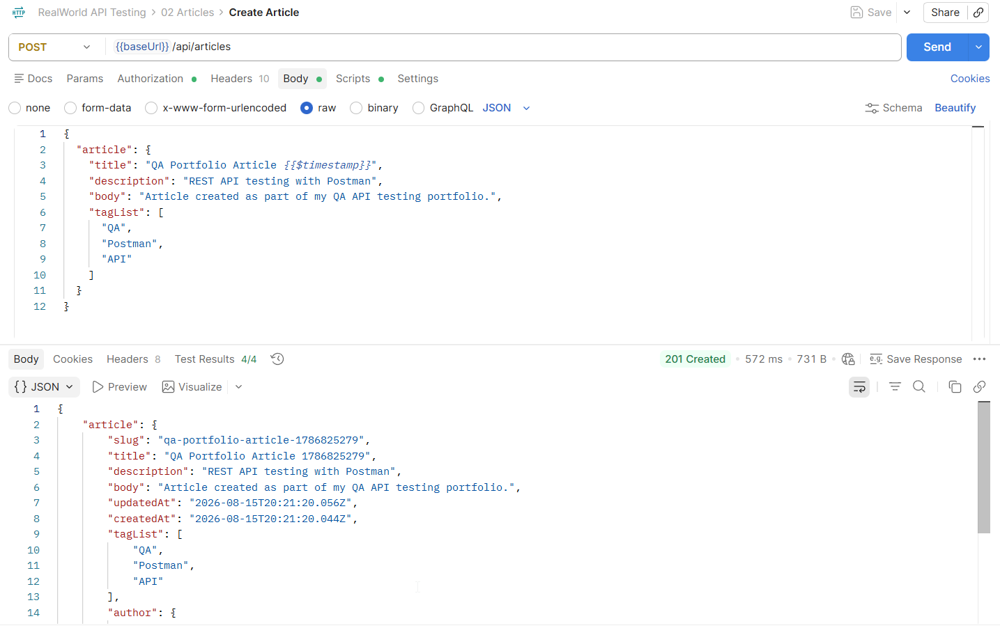
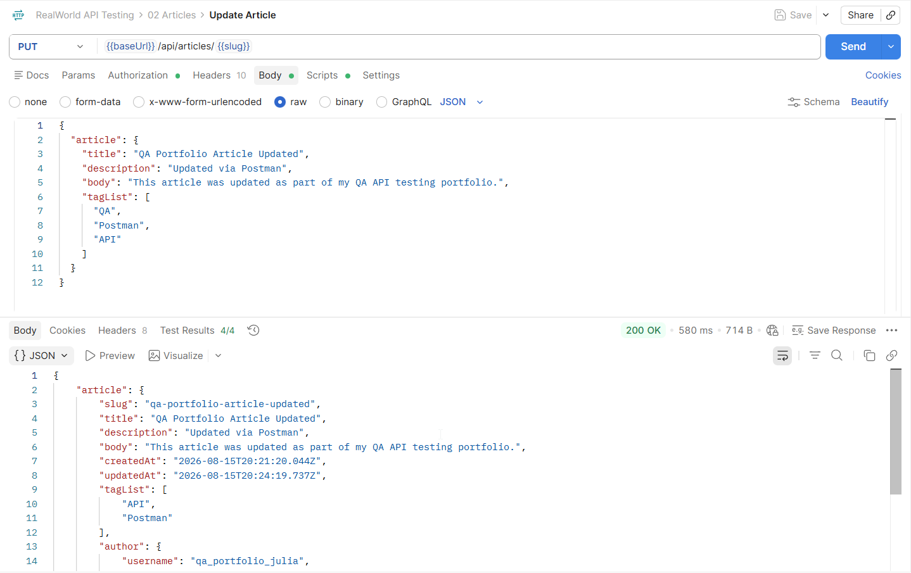
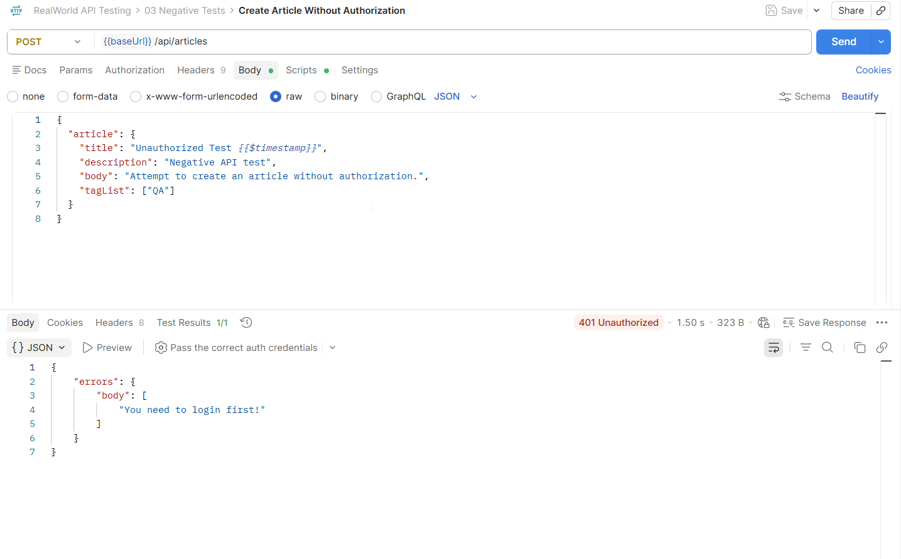
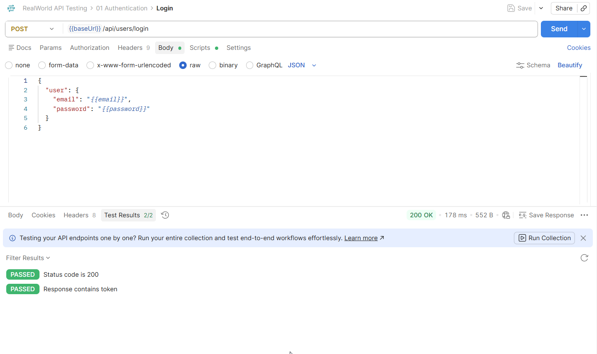

# REST API Testing — Postman

Учебный проект по тестированию REST API веб-приложения RealWorld с использованием Postman.

Цель проекта — продемонстрировать практические навыки тестирования API: работу с HTTP-запросами, авторизацией, переменными окружения, позитивными и негативными сценариями и автоматическими проверками.

## 🛠 Инструменты

- Postman
- REST API
- HTTP
- JSON
- Environment Variables
- Postman Tests
- Token Authorization

## 🔐 Authentication

### Login

`POST /api/users/login`

Проверяется:

- успешная авторизация;
- HTTP Status Code `200`;
- наличие token в ответе;
- автоматическое сохранение token в Environment.

Полученный token используется для авторизованных запросов.

## 📝 CRUD-тестирование Articles

### Create Article

`POST /api/articles`

Проверяется:

- HTTP Status Code `201`;
- наличие объекта `article`;
- наличие `slug`;
- наличие `title`;
- автоматическое сохранение `slug` в Environment.

### Get Article

`GET /api/articles/{{slug}}`

Проверяется:

- HTTP Status Code `200`;
- наличие объекта `article`;
- соответствие `slug` сохранённому значению;
- наличие `title`.

### Update Article

`PUT /api/articles/{{slug}}`

Проверяется:

- HTTP Status Code `200`;
- изменение `title`;
- изменение `description`;
- наличие объекта `article`;
- сохранение актуального `slug`.

### Delete Article

`DELETE /api/articles/{{slug}}`

Фактический результат:

`200 OK`

После удаления выполняется повторный GET-запрос.

### Get Deleted Article

`GET /api/articles/{{slug}}`

Фактический результат:

`404 Not Found`

Таким образом проверяется, что удалённая статья больше недоступна.

## ❌ Negative Testing

### Создание статьи без авторизации

`POST /api/articles`

Результат:

`401 Unauthorized`

### Получение несуществующей статьи

`GET /api/articles/nonexistent-article-qa-test`

Результат:

`404 Not Found`

### Авторизация с неправильным паролем

`POST /api/users/login`

Результат:

`422 Unprocessable Entity`

## ⚙️ Environment Variables

В проекте используются:

- `{{baseUrl}}`
- `{{email}}`
- `{{password}}`
- `{{token}}`
- `{{slug}}`

Token после успешной авторизации сохраняется автоматически.

Slug созданной статьи автоматически сохраняется и используется в последующих GET, PUT и DELETE-запросах.

## 🤖 Postman Tests

Пример проверки HTTP Status Code:

```javascript
pm.test("Status code is 200", function () {
    pm.response.to.have.status(200);
});
```

Пример проверки объекта `article`:

```javascript
const jsonData = pm.response.json();

pm.test("Response contains article", function () {
    pm.expect(jsonData.article).to.exist;
});
```

Пример автоматического сохранения `slug`:

```javascript
const jsonData = pm.response.json();

if (jsonData.article && jsonData.article.slug) {
    pm.environment.set("slug", jsonData.article.slug);
}
```

## 📂 Postman Collection

Коллекция Postman:

[RealWorld-API.postman_collection.json](Postman-Collection/RealWorld-API.postman_collection.json)

Безопасное окружение:

[RealWorld-Portfolio.postman_environment.json](Postman-Collection/RealWorld-Portfolio.postman_environment.json)

Реальные email, password и token в публичном Environment не хранятся.

## 📸 Примеры выполнения запросов

### Create Article

Создание статьи методом POST и автоматические проверки ответа.



### Update Article

Обновление существующей статьи методом PUT и проверка изменённых полей.



### Negative Test — запрос без авторизации

Попытка создать статью без авторизации.

Результат: `401 Unauthorized`.



### Login

Успешная авторизация и автоматические проверки ответа.



## 📌 Что демонстрирует проект

- тестирование REST API;
- GET, POST, PUT и DELETE;
- CRUD-тестирование;
- позитивные и негативные сценарии;
- проверку HTTP Status Codes;
- работу с JSON;
- Token Authorization;
- Environment Variables;
- передачу данных между запросами;
- автоматические проверки в Postman.
