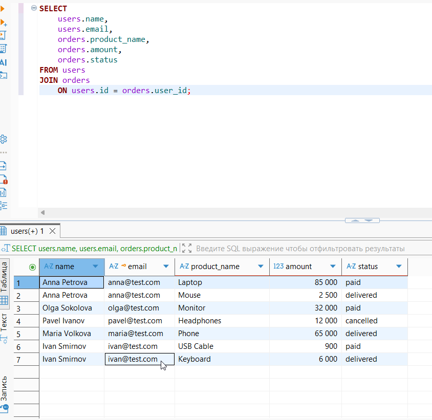
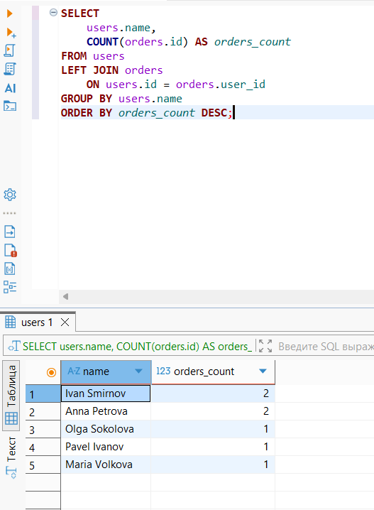
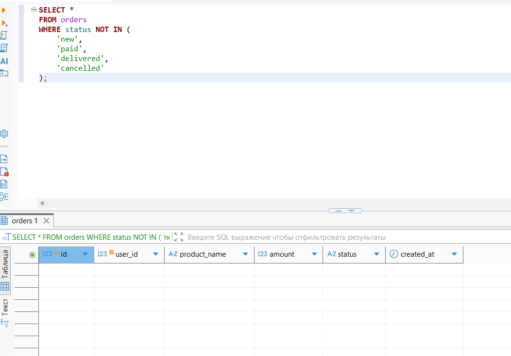

# SQL Practice Project

Учебный проект по работе с базой данных PostgreSQL с использованием DBeaver.

Цель проекта — продемонстрировать практические навыки работы с SQL и применение SQL для проверки данных с позиции QA.

## 🗄 Структура базы данных

В проекте используются две связанные таблицы:

### users

Содержит данные пользователей:

- id
- name
- email
- age
- city

### orders

Содержит данные заказов:

- id
- user_id
- product_name
- amount
- status
- created_at

Таблицы связаны:

`users.id → orders.user_id`

Для связи используется FOREIGN KEY.

## 🛠 Использованные SQL-конструкции

В проекте применяются:

- CREATE TABLE
- PRIMARY KEY
- FOREIGN KEY
- INSERT
- SELECT
- WHERE
- ORDER BY
- GROUP BY
- COUNT
- SUM
- JOIN
- LEFT JOIN
- UPDATE
- DELETE

## 🧪 QA-проверки данных

С помощью SQL выполнялись проверки:

- наличия нужных записей в базе;
- корректности данных пользователя;
- корректности данных заказа;
- связи пользователя с его заказами;
- количества заказов пользователя;
- дублирующихся email;
- заказов с нулевой или отрицательной суммой;
- заказов с недопустимыми статусами;
- результатов после INSERT, UPDATE и DELETE.

## 🔗 SQL-запросы

Полный набор запросов находится в файле:

[SQL-Queries.sql](SQL-Queries.sql)

## 📸 Примеры выполнения запросов

### JOIN — пользователь и его заказы

Запрос объединяет таблицы `users` и `orders` и позволяет проверить, какому пользователю принадлежит заказ.

### LEFT JOIN + GROUP BY — количество заказов

Запрос показывает количество заказов для каждого пользователя.

### Проверка допустимых статусов заказа

QA-проверка на наличие заказов со статусами, не предусмотренными тестовыми данными.

Ожидаемый результат: `0 строк`.

## 💻 Инструменты

- PostgreSQL
- DBeaver
- SQL

## 📌 Что демонстрирует проект

Проект демонстрирует базовые практические навыки работы с реляционной базой данных:

- создание таблиц и связей;
- получение и изменение данных;
- объединение связанных таблиц;
- группировку и агрегирование данных;
- проверку корректности данных с помощью SQL.
