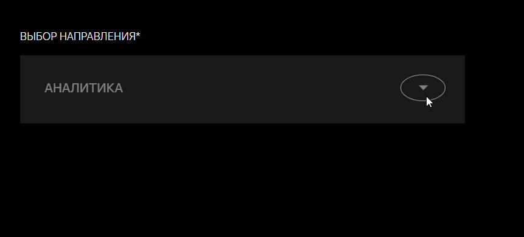
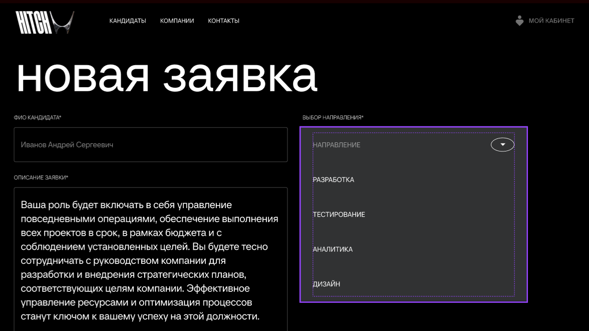

# BUG-007 — Не раскрывается выпадающий список в форме «Новая заявка»

**YouGile ID:** ETA-71  
**Модуль:** Личный кабинет компании / Новая заявка  
**Тип:** Функциональный / UI  
**Приоритет:** Medium / Средний  
**Статус:** Reopened / Переоткрыт  

## 🌐 Окружение

- **Платформа:** Web
- **Браузеры:** Google Chrome, Yandex Browser

## 📋 Предусловия

1. Открыть сайт Hitch.
2. Авторизоваться под учётной записью компании.

## 🔄 Шаги воспроизведения

1. В личном кабинете компании в разделе «Поиск сотрудников» выбрать кандидата и перейти в его анкету.
2. В анкете кандидата нажать кнопку «Отправить заявку».
3. Развернуть выпадающий список.

## ❌ Фактический результат

Выпадающий список не раскрывается.

 

## ✅ Ожидаемый результат

Выпадающий список раскрывается и отображает доступные варианты:

- «Разработка»;
- «Тестирование»;
- «Аналитика»;
- «Дизайн».

 

## 📎 Источник

Дефект зарегистрирован в YouGile под ID **ETA-71** в рамках ручного тестирования веб-приложения Hitch.
