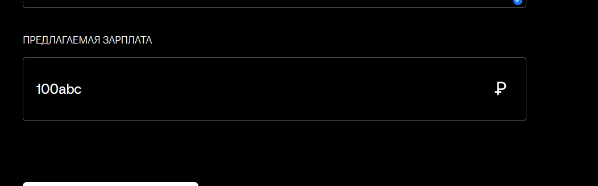

# BUG-009 — Не появляется сообщение об ошибке при вводе нецифровых символов в поле «Предлагаемая зарплата»

**YouGile ID:** ETA-73  
**Модуль:** Личный кабинет компании / Новая заявка  
**Тип:** Функциональный / Валидация  
**Приоритет:** High / Высокий  
**Статус:** Closed / Закрыт  

## 🌐 Окружение

- **Платформа:** Web
- **Браузеры:** Google Chrome, Yandex Browser

## 📋 Предусловия

1. Открыть сайт Hitch.
2. Авторизоваться под учётной записью компании.

## 🔄 Шаги воспроизведения

1. В личном кабинете компании открыть раздел «Поиск сотрудников».
2. Выбрать кандидата и перейти в его анкету.
3. В анкете кандидата нажать кнопку «Отправить заявку».
4. Убедиться, что поля «ФИО» и «Направление» заполнены автоматически.
5. В поле «Предлагаемая зарплата» ввести нецифровые символы (буквы или другие символы).

## ❌ Фактический результат

Поле «Предлагаемая зарплата» допускает ввод нецифровых символов. Сообщение об ошибке не отображается.

 

## ✅ Ожидаемый результат

Поле «Предлагаемая зарплата» не должно принимать символы, кроме цифр.

## 📎 Источник

Дефект зарегистрирован в YouGile под ID **ETA-73** в рамках ручного тестирования веб-приложения Hitch.
